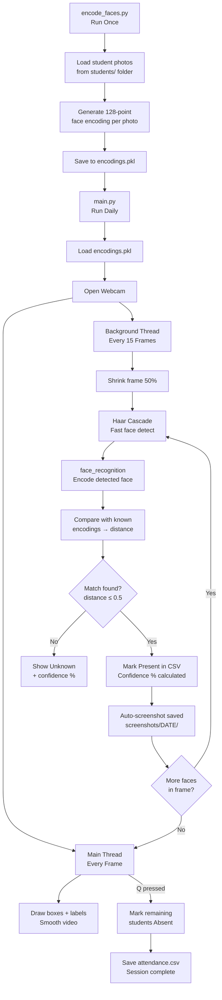

# Assignment 4(C) – Attendance Detection System

## 🔗 Links

- **DTT Workspace:** [https://dtt-workspace03.vercel.app/](https://dtt-workspace03.vercel.app/)

---

## Project Overview

Complete real-time attendance system using **Python**, **OpenCV**, **Haar Cascade**, and **face_recognition (dlib)**.
Captures faces from webcam → detects → recognizes → marks attendance automatically:

| Output | Meaning |
|--------|---------|
| attendance.csv | Single CSV — all days, present + absent both tracked |
| screenshots/YYYY-MM-DD/ | Auto-screenshot per student on first recognition |
| Terminal Output | Live present/absent log with confidence % |
| Auto Folders | `screenshots/` auto-created on run |
| Multi-Student Support | All students processed simultaneously |
| Confidence % | Match confidence shown on screen per face |

---

## Project Structure

```
Attendance-System/
│
├── students/                        ← Add student photos here
│   ├── Meloni.jpg                   ← single photo (works great)
│   ├── Modi_1.jpg                   ← multiple photos → better accuracy
│   └── Modi_2.jpg
│
├── screenshots/                     ← Auto-created on run
│   └── 2026-05-24/
│       ├── Modi_091432.png          ← auto-saved on recognition
│       └── Meloni_091605.png
│
├── encode_faces.py                  ← Run ONCE to encode student photos
├── main.py                          ← Run daily for attendance
├── requirements.txt
├── encodings.pkl                    ← Auto-generated by encode_faces.py
├── attendance.csv                   ← Auto-generated by main.py
└── README.md
```

---

## Technologies Used

| Tool | Purpose |
|------|---------|
| Python 3.x | Core programming language |
| OpenCV (cv2) | Webcam capture, Haar Cascade face detection, drawing |
| face_recognition | dlib-based 128-point face encoding + comparison |
| numpy | Distance calculations for best match |
| threading | Background recognition — smooth lag-free video |
| csv / datetime | Attendance logging |

---

## Recognition Pipeline



---

## Setup & Installation

### Step 1 — Install Python Libraries

```bash
pip install -r requirements.txt
```

### Step 2 — Verify Installation

```bash
python -c "import face_recognition; print('OK')"
```

### Step 3 — Add Student Photos

Place photos inside `students/` folder.

**1 photo per student — perfectly fine:**
```
students/
  Modi.jpg
  Meloni.jpg
```

**Multiple photos for better accuracy (optional):**
Use `Name_1.jpg`, `Name_2.jpg` format — system auto-groups by name.
```
students/
  Modi_1.jpg      ← different angle
  Modi_2.jpg      ← different lighting
  Meloni.jpg      ← single photo, works great
```

**Tips for good photos:**
- Clear front-facing face
- Good lighting, no blur
- One face per photo
- JPG or PNG accepted

### Step 4 — Encode Faces (run ONCE)

```bash
python encode_faces.py
```

Re-run only when new students are added.

### Step 5 — Run Attendance System

```bash
python main.py
```

---

## Controls

| Key | Action |
|-----|--------|
| Q | Quit + auto-mark absent students in CSV |
| S | Manual screenshot |

---

## Output

### Attendance CSV (`attendance.csv`)

```
Name,    Date,       Time,     Status,  Confidence
Modi,    2026-05-24, 09:14:32, Present, 94.2%
Meloni,  2026-05-24, 09:16:05, Present, 91.8%
Modi,    2026-05-25, 09:10:11, Present, 92.5%
Meloni,  2026-05-25, --:--:--, Absent,
```

### Screenshots (`screenshots/`)

```
screenshots/
  2026-05-24/
    Modi_091432.png         ← auto-saved on recognition
    Meloni_091605.png
    manual_093000.png       ← S key screenshot
  2026-05-25/
    Modi_091011.png
```

---

## Confidence Guide

| Confidence | Meaning |
|---|---|
| 85–100% | Strong match |
| 70–84% | Good match |
| 50–69% | Weak — add more photos |
| < 50% | No match → Unknown |

---

## Troubleshooting

| Issue | Fix |
|-------|-----|
| `encodings.pkl not found` | Run `encode_faces.py` first |
| `dlib install failed` | Install CMake first → retry pip |
| Webcam not opening | Change `VideoCapture(0)` to `VideoCapture(1)` |
| Always shows Unknown | Lower `TOLERANCE` in main.py (try 0.6) or add more photos |
| Lag / slow video | Normal on first run — model loading. Threading handles it after. |

---

## Conclusion

This project demonstrates a complete real-time face recognition attendance system using Python, OpenCV, and dlib. The system uses threading for smooth video, Haar Cascade for fast detection, and face_recognition for accurate identification. It automatically tracks present and absent students, saves confidence scores, and organizes screenshots by date.
